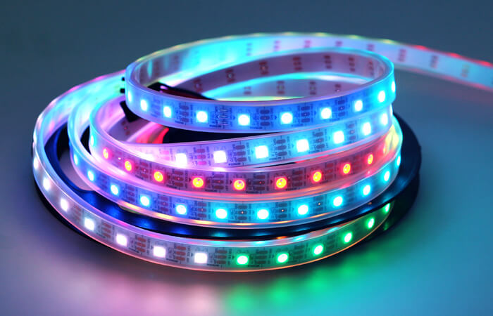

<p align="center"></p>

<p align="center"></p>

<h1 align="center">
    <strong>Arduino Thermometer</strong>
</h1>
<h3 align="center">
    <p>Two sensor thermometer with RGB LED strips</p>
</h3>

<hr>

<p align="center"></p>

### Contents
- [Hardware](#Hardware)
- [Setup](#Setup)
- [Code](#Code)
- [Easter Egg](#easter-egg)

### Hardware

Arduino UNO
<p></p>
 
Adressable WS2812B RGB LED strip with 60 leds per 1 meter.
Current setup will use 2 x 59 leds.
<p></p>

Two DS18B20 temperature sensors. 
Mind the order of 3 connectors.
<p></p>

AC/DC power adapter(5V 3A 15W MAX is enough for current project).
<p></p>

Two 220 Ohm resistors for led strips. 
<p></p>

One 4.7 kiloOhm resistor for temperature sensors.
Without it temperature readings would get disturbed.
<p></p>

### Setup
<p></p>

### Code

Current thermometer shows temperature in Celsius. Below zero pixels are blue above zero red. Zero pixel is bright green color. Every fifth pixel is little bit brighter than others. After 10 seconds temperatures are updated and leds lights up.

```
#include <OneWire.h>
#include <DallasTemperature.h>
#include <Adafruit_NeoPixel.h>

// Temperature sensor connection
#define ONE_WIRE_BUS 2
// LED strip
#define NLED 59
#define PIN_1 8
#define PIN_2 7

Adafruit_NeoPixel pixels_1 = Adafruit_NeoPixel(NLED, PIN_1, NEO_GRB+NEO_KHZ800);
Adafruit_NeoPixel pixels_2 = Adafruit_NeoPixel(NLED, PIN_2, NEO_GRB+NEO_KHZ800);

// OneWire connection 
OneWire oneWire(ONE_WIRE_BUS);  

// Pass oneWire reference to DallasTemperature library
DallasTemperature sensors(&oneWire);

// Variable for moving temperature display on LED strip
int change = -5;
int deviceCount = 0;
float tempC;
int counter = 4;

void setup(void)
{
	
  sensors.begin();  // Start up the library
  Serial.begin(9600);
  pixels_1.begin();
  pixels_2.begin();
  pixels_1.show();
  pixels_2.show();
  
  // locate devices on the bus
  Serial.print("Locating devices...");
  Serial.print("Found ");
  deviceCount = sensors.getDeviceCount();
  Serial.print(deviceCount, DEC);
  Serial.println(" devices.");
  Serial.println("");
}

void loop(void)
{ 
  // Send command to all the sensors for temperature conversion
  sensors.requestTemperatures(); 
  
  // Display temperature from each sensor
  for (int i = 0;  i < deviceCount;  i++)
  {
    Serial.print("Sensor ");
    Serial.print(i+1);
    Serial.print(" : ");
    tempC = sensors.getTempCByIndex(i);
    Serial.print(tempC);
    Serial.print((char)176);//shows degrees character
    Serial.print("C  |  ");
    Serial.print(DallasTemperature::toFahrenheit(tempC));
    Serial.print((char)176);//shows degrees character
    Serial.println("F");
  }
  
  Serial.println("");
  delay(1000);

    for (int i = 0; i <= 59; i++){  // 59 LEDs on current project
    int r_1 = 0;
    int r_2 = 0;
    int g_1 = i-19 - change;
    int g_2 = i-19 - change;
    int b_1 = (29 - i + change)/2;
    int b_2 = (29 - i + change)/2;
    
    if(i > 28 + change){
      r_1 = (i - 29 - change)/2;
      r_2 = (i - 29 - change)/2;
      g_1 = (40 - i + change)/2;
      g_2 = (40 - i + change)/2;
      b_1 = 0;
      b_2 = 0;
    }

    if(i == 29 + change){ g_1 = 30; g_2 = 30; }

    // Every 5th pixel is brighter
    if(((i + 1) % 5) == 0){ 
      r_1 *= 5; 
      r_2 *= 5; 
      g_1 *= 5; 
      g_2 *= 5; 
      b_1 *= 5; 
      b_2 *= 5; 
      }

                  // Easter Egg
      if(counter <= 0){  
        r_1 = random(0, 10); 
        r_2 = random(0, 10); 
        g_1 = random(0, 10); 
        g_2 = random(0, 10); 
        b_1 = random(0, 10); 
        b_2 = random(0, 10); 
        }

    if(r_1 < 1){ r_1 = 0; }
    if(r_2 < 1){ r_2 = 0; }
    if(g_1 < 1){ g_1 = 0; }
    if(g_2 < 1){ g_2 = 0; }
    if(b_1 < 1){ b_1 = 0; }
    if(b_2 < 1){ b_2 = 0; }

    if(i > 29 + sensors.getTempCByIndex(0) + change){ r_1 = 0; g_1 = 0; b_1 = 0; }
    if(i > 29 + sensors.getTempCByIndex(1) + change){ r_2 = 0; g_2 = 0; b_2 = 0; }

    pixels_1.setPixelColor(i,r_1,g_1,b_1);
    pixels_2.setPixelColor(i,r_2,g_2,b_2);
    pixels_1.show();
    pixels_2.show();

    //Serial.print(r_1);
    //Serial.print(" ");
    //Serial.print(g_1);
    //Serial.print(" ");
    //Serial.println(b_1);
    delay(20);
  }  
  
  if(counter <= 0){ counter = random(1, 1000); }
  counter -= 1;
  Serial.print(counter);
  delay(10000);
  for(int j = 0; j <= 60; j++){
    pixels_1.setPixelColor(j,0,0,0);
    pixels_2.setPixelColor(j,0,0,0);
    pixels_1.show();
    pixels_2.show();
  }
}
```

### Easter Egg

There is a easter egg in code.
After random interval(from 1 - 1000) LED strips will light up random color.
