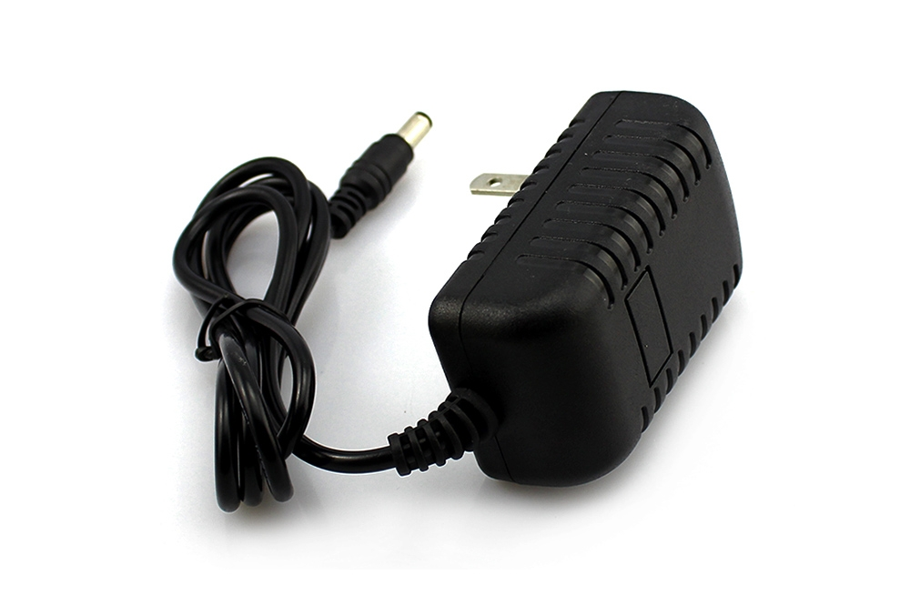

<h1 align="center">
    <strong>Arduino Thermometer</strong>
</h1>
<h3 align="center">
    
Two sensor thermometer with RGB LED strips

</h3>

### Contents
- [Hardware](Hardware)
- [Setup](Setup)

### Hardware

Arduino UNO

 

Adressable WS2812B RGB LED strip with 60 leds per 1 meter.
Current setup will use 2 x 59 leds.

Two DS18B20 temperature sensors. 
Mind the order of 3 connectors.

AC/DC power adapter(5V 3A 15W MAX is enough for current project).

Two 220 Ohm resistors for led strips. 

One 4.7 kiloOhm resistor for temperature sensors.
Without it temperature readings would get disturbed and not correct.
